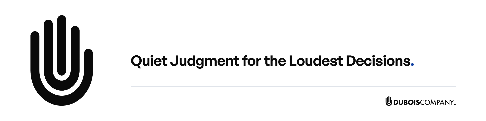

<picture>
  <source media="(prefers-color-scheme: dark)" srcset="assets/org-banner-dark.png">
  
</picture>

We are the call leaders make when they cannot afford to be wrong. When the stakes are highest and the path is not obvious, we have already done the work.

## How We Work

Three disciplines, applied in that order.

**Verified Truth.** An independent factual foundation built before any recommendation.

**Creative Judgment.** Imagination leads. Craftsmanship delivers.

**Discreet Execution.** Confidentiality treated as discipline, not clause.

## Published Work

What follows is the method itself, published together with the checks that prove it runs.

### [`agent-operations-handbook`](https://github.com/DuBois-Company/agent-operations-handbook)

An implementer's guide to a self-improving agent orchestration system, built for partial adoption. It covers the control plane, the knowledge graph project layer, and the lessons loop in one place, with a glossary that keeps the vocabulary consistent front to back. A day-one path to a working system, not a theory chapter to translate alone.

### [`agent-operations-template`](https://github.com/DuBois-Company/agent-operations-template)

An installable orchestration standard, a harness that checks it by exit code, and a worked example. The worked example shows a mid-project state, and CI runs the checks on every push. Copy the standard, run the checks, scaffold from the worked example, same day.

The handbook teaches the method. The template installs it.

The handbook is published under CC BY 4.0 and the template under the MIT License.

---

DuBois Company. [duboiscompany.com](https://duboiscompany.com)
